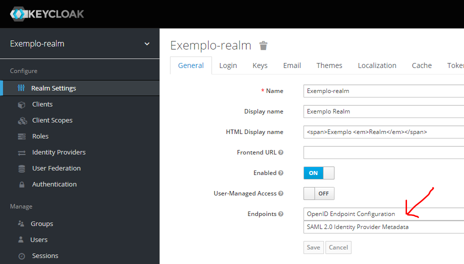

# Keycloak

Segue orientações para instalação e uso do Keycloak localmente, no Windows 10+.

## Pré-requisitos

- Windows 10 ou superior
- WSL2 (não serve WSL1)
- Imagem `Ubuntu-20.04` (pode ser outra, mas o exemplo usa essa)

Use `wsl -l -v`. É necessário que a imagem usada esteja na versão 2. É possível fazer o upgrade usando `wsl --set-version <distro name> 2`.

Precisamos ter instalados no WSL:

- `podman`
- `buildah`
- `python` 3.x, o mais recente possível
- `pip3`
- `podman-compose`

## Dicas de instalação

Execute sua instância WSL desejada.

Instale primeiro o Python e o pip, usando qualquer método desejado.

Instale o `podman`, seguindo o procedimento:

```bash
. /etc/os-release
sudo sh -c "echo 'deb http://download.opensuse.org/repositories/devel:/kubic:/libcontainers:/stable/x${NAME}_${VERSION_ID}/ /' > /etc/apt/sources.list.d/devel:kubic:libcontainers:stable.list"
wget -nv https://download.opensuse.org/repositories/devel:kubic:libcontainers:stable/x${NAME}_${VERSION_ID}/Release.key -O Release.key
sudo apt-key add - < Release.key
sudo apt-get update -qq
sudo apt-get -qq -y install podman
sudo mkdir -p /etc/containers
echo -e "[registries.search]\nregistries = ['docker.io', 'quay.io']" | sudo tee /etc/containers/registries.conf
```

Teste usando `podman info`.

Instale o `buildah`:

```bash
sudo apt-get -qq -y install buildah
```

Teste usando `buildah info`.

Instale o `podman-compose` usando o `pip3`.

```bash
pip3 install podman-compose
```

Teste usando `podman-compose version`.

Caso não esteja no path, use algo como:

```bash
echo "export PATH=\"/home/<SEU_USUÁRIO>/.local/bin:\$PATH\"" >> ~/.bashrc && source ~/.bashrc
```

## Composefile

Vamos usar uma imagem oficial do Keycloak em um Composefile. Usaremos `podman`/`buildah` para substituir o Docker, e `podman-compose` em vez do Docker Compose.

Crie o seguinte arquivo:

`docker-compose.yml`
```yaml
version: "3"
volumes:
  postgres_data:
    driver: local
services:
  postgres:
    image: postgres
    volumes:
      - postgres_data:/var/lib/postgresql/data
    environment:
      POSTGRES_DB: keycloak
      POSTGRES_USER: keycloak
      POSTGRES_PASSWORD: pOStrgESSpwd_1
  keycloak:
    image: quay.io/keycloak/keycloak:latest
    environment:
      DB_VENDOR: POSTGRES
      DB_ADDR: postgres
      DB_DATABASE: keycloak
      DB_USER: keycloak
      DB_SCHEMA: public
      DB_PASSWORD: pOStrgESSpwd_1
      KEYCLOAK_USER: admin
      KEYCLOAK_PASSWORD: keycloakSeCrEt#
    ports:
      - 48080:8080
    depends_on:
      - postgres
```

Execute:

```bash
podman-compose up
```

O que subirá:

- Uma instância de Postgres
- Uma instância de Keycloak:
  - Admin: http://localhost:48080/
  - User: admin
  - Password: keycloakSeCrEt#

_Caso deseje acessar externamente pelo Windows, pode ser necessário fazer o _port proxying_._

```bat
netsh interface portproxy add v4tov4 listenport=<porta-a-redirecionar> listenaddress=0.0.0.0 connectport=<porta-ouvindo-no-WSL> connectaddress=<IP-interno-do-WSL>
```

## Keycloak Admin Console

Adicionar um Realm:


Endpoints:



Algo como:


